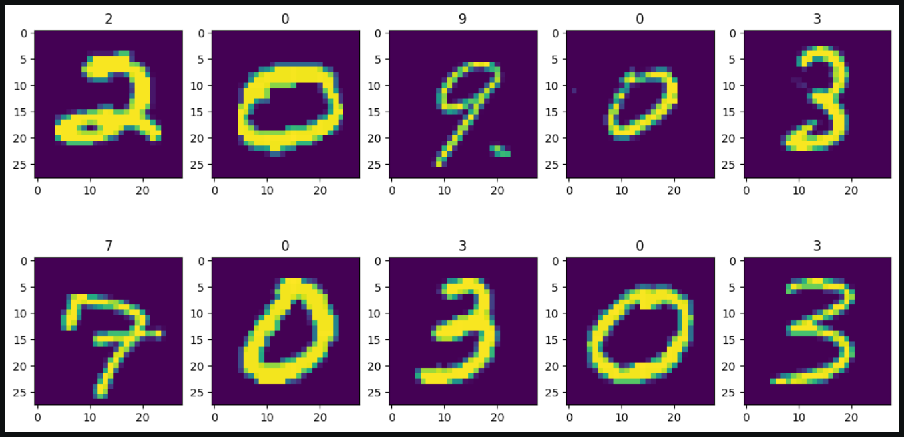
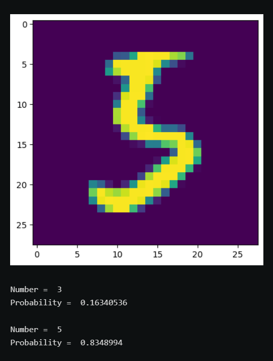
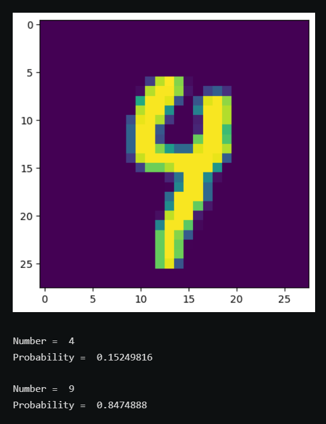
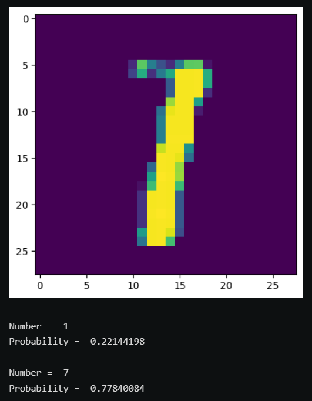

# Digit-Recognizer
Recognition of handwritten digits from the MNIST dataset.

## Results

This model had an accuracy of 99.175% on Kaggle  

## Some examples where the model went wrong
 
---
 
---
 